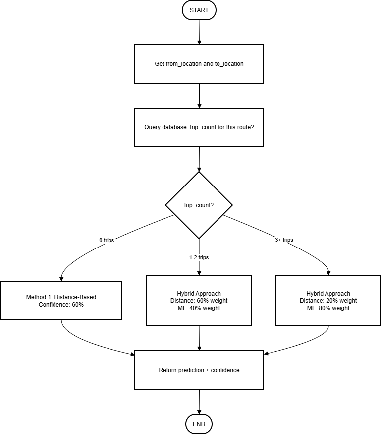

# System Architecture

## High-Level Overview

The system consists of five main layers:

1. **Frontend Layer**: Web and mobile applications
2. **API Layer**: REST API and WebSocket server
3. **Intelligence Hub**: Central brain for cross-module analysis
4. **Application Layer**: Django modules (Tasks, Workouts, Finance, Location)
5. **Data Layer**: PostgreSQL and Redis

## Module Integration (Tight Coupling)

### Why Tight Integration?

All modules communicate directly for maximum intelligence:

**Tasks Module:**
- Checks workout fatigue before scheduling
- Adjusts duration based on energy levels
- Links to expenses when money is spent
- Uses location context for scheduling

**Workouts Module:**
- Auto-creates tasks for planned sessions
- Tracks location where workout occurs
- Feeds fatigue data to task scheduler
- Updates energy levels in real-time

**Finance Module:**
- Auto-tags expenses based on current location
- Links expenses to active tasks
- Monitors budget to calculate stress levels
- Affects task scheduling when over budget

**Location Module:**
- Detects work locations and auto-creates tasks
- Prompts for expenses when leaving shopping areas
- Learns travel patterns for ETA predictions
- Provides context to all other modules

**Intelligence Hub:**
- Analyzes data from all modules
- Makes cross-module predictions
- Schedules tasks considering all factors
- Trains ML models on integrated data

## Database Entity Relationships

### Key Relationships

**User** has many:
- Tasks
- Workout Sessions
- Expenses
- Locations

**Task** can reference:
- Location (where to do it)
- Workout Session (if task is a workout)
- Expense (if task cost money)

**Workout Session** contains:
- Multiple exercises
- Location (where performed)
- Links to Task (if scheduled)

**Expense** links to:
- Location (where spent)
- Task (what it was for)
- Auto-tagged flag (system linked it)

**Location** tracks:
- Visits (arrival/departure times)
- Tasks done there
- Expenses made there

This tight coupling enables intelligence across modules.

## User Flow: Create Task

### Process

1. User creates task via web app
2. API receives request and asks Intelligence Hub for context
3. Intelligence Hub queries:
   - Workouts: Recent sessions and fatigue level
   - Location: Current zone (home, work, etc.)
   - Tasks: Today's workload
4. Intelligence calculates optimal time considering:
   - Base estimated duration
   - Fatigue multiplier (workout soreness)
   - Location appropriateness
   - Daily workload
5. Task saved with AI recommendations
6. User sees task with insights

### Example

User creates "Code review" task:
- Base estimate: 60 minutes
- Recent heavy workout: +30% fatigue = +18 minutes
- At home: Optimal for focused work
- Already worked 4 hours: Moderate load
- **Final**: 78 minutes, suggested time 15:00

## Real-Time Workout Session

### Live Tracking Process

1. User starts workout on mobile app
2. WebSocket connection established
3. Session initialized in database
4. For each set:
   - User completes reps
   - Data sent via WebSocket
   - Database updated immediately
   - Rest timer monitored
5. If rest time exceeds 130% of target:
   - Intelligence analyzes remaining time
   - Suggests modifications (skip sets)
   - User decides to accept or continue
6. Session finalized:
   - Statistics calculated
   - ML models updated
   - Summary shown to user

### Adaptive Intelligence

System adapts in real-time:
- Detects when falling behind schedule
- Calculates if workout can be completed
- Suggests specific modifications
- Learns from actual vs planned performance

## Work Travel Intelligence

### Scenario: Monthly Mine Inspection

**Departure (08:00)**
- Mobile app tracks GPS
- Records departure from home
- Monitors speed during travel

**Arrival (09:30)**
- GPS detects proximity to known location
- Database query finds "XYZ Mine"
- Identified as work location
- Auto-creates "XYZ Mine Inspection" task
- Logs visit with travel time (90 minutes)
- Updates ML model with new data point

**Historical Learning**
- Previous trips: 85, 92, 88 minutes
- New average: 88.75 minutes
- Next prediction will use this data

**On-Site (10:30)**
- User logs expense R500 for fuel
- System detects at work location
- Finds active inspection task
- Auto-links expense to task
- Tags as work-related expense

**Departure (14:00)**
- GPS detects leaving geofence
- Updates visit duration (4.5 hours)
- Stores travel history
- Ready for next ETA prediction

### ETA Prediction Improvement

First visit to new mine:
- Uses Haversine distance + average speed
- Confidence: 60%
- Estimate may be off by 20-30%

After 3 visits:
- Uses historical average
- Considers time of day
- Confidence: 85%
- Estimate accurate within 10%

After 10+ visits:
- ML model trained on specific route
- Adjusts for traffic patterns
- Confidence: 95%
- Highly accurate predictions

## ETA Prediction Flow

See [Hybrid ETA Algorithm](hybrid-eta-algorithm.md) for complete specification.

## Technology Stack

### Layer Details

**Presentation Layer**
- React 19: Modern UI with hooks
- TypeScript: Type safety
- Tailwind CSS: Utility-first styling
- Redux Toolkit: State management
- React Native: Mobile cross-platform
- Expo: Native API access

**API Layer**
- Django REST Framework: RESTful APIs
- JWT Authentication: Secure tokens
- Django Channels: WebSocket support
- Redis: WebSocket message broker

**Business Logic**
- Intelligence Hub: Cross-module analysis
- Django Apps: Modular features
- Celery: Background job processing

**Data Persistence**
- PostgreSQL: Relational database with foreign keys
- Redis: Caching and queue management

**Background Processing**
- Celery Workers: Async tasks
- Celery Beat: Scheduled jobs
- ML Training: Periodic model updates

## Deployment Architecture (Future)

When deploying to production:

**Load Balancer**
- Nginx for reverse proxy
- SSL termination
- Static file serving

**Application Servers**
- Multiple Django instances (horizontal scaling)
- Gunicorn WSGI server
- Daphne for WebSockets

**Databases**
- PostgreSQL primary with optional replicas
- Redis for caching and queues

**Background Workers**
- Celery workers on separate machines
- Celery Beat scheduler

**Monitoring**
- Logging with Django logging framework
- Error tracking
- Performance monitoring

## Key Design Decisions

**Why Tight Integration?**
- Maximum intelligence across domains
- No duplicate data or logic
- Unified user experience
- Powerful cross-module insights

**Why WebSockets?**
- Real-time workout tracking essential
- Live location updates
- Instant notifications
- Better UX than polling

**Why PostgreSQL?**
- Strong relational model needed
- Foreign keys enforce data integrity
- Complex joins for intelligence queries
- ACID compliance for consistency

**Why Redis?**
- Fast caching for API responses
- WebSocket channel layer
- Celery message broker
- Session storage

**Why Machine Learning?**
- Predictions improve with usage
- Personalized to each user
- Adapts to changing patterns
- Data-driven recommendations

## Next Steps

1. Implement database schema
2. Build Django models
3. Create API endpoints
4. Develop intelligence hub
5. Build frontend applications
6. Deploy and test

See [Implementation Plan](implementation-plan.md) for detailed steps.